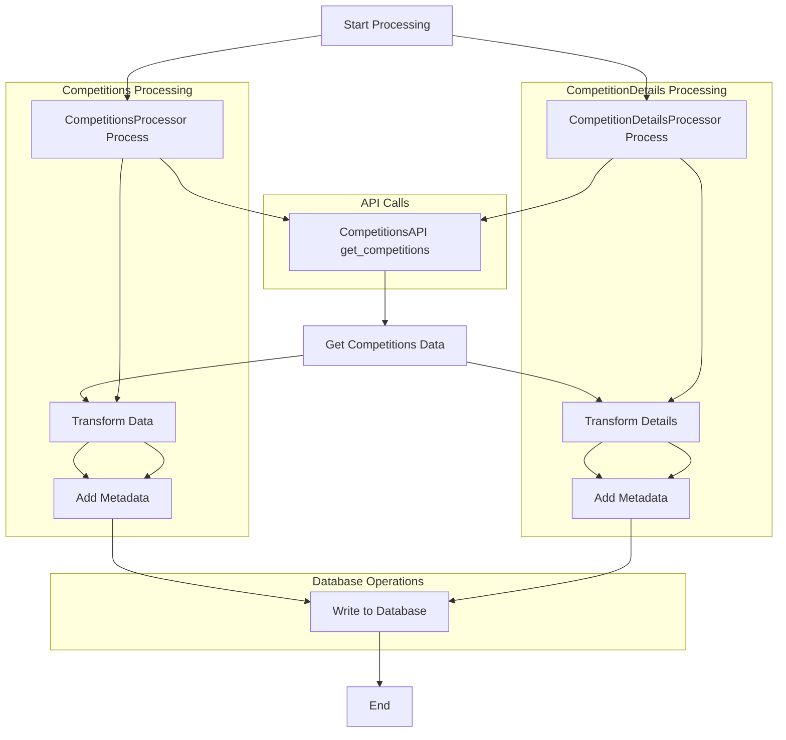

# Competitions

## Workflow (Processor + API)


??? info "CompetitionsAPI Class"
    ::: src.utils.competitions_api.CompetitionsAPI
        options:
            filters: []
            group_by_category: true
            members_order: source

??? info "CompetitionsProcessor Class"
    ::: src.utils.competitions_api.CompetitionsProcessor
        options:
            filters: []
            group_by_category: true
            members_order: source

??? info "CompetitionsDetailsProcessor Class"
    ::: src.utils.competitions_api.CompetitionsProcessor
        options:
            filters: []
            group_by_category: true
            members_order: source

## Queries
??? info "Create Queries - Schema"
    ```sql
    --8<-- "src/utils/queries/create_queries.py"
    ```