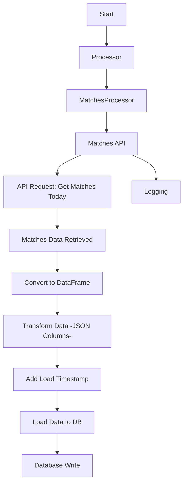

# Matches

## Workflow (Processor + API)


??? info "MatchesAPI Class"
    ::: src.utils.matches_api.MatchesAPI
        options:
            filters: []
            group_by_category: true
            members_order: source

??? info "MatchesProcessor Class"
    ::: src.utils.matches_api.MatchesProcessor
        options:
            filters: []
            group_by_category: true
            members_order: source

## Queries
??? info "Create Queries - Schema"
    ```sql
    --8<-- "src/utils/queries/create_queries.py"
    ```