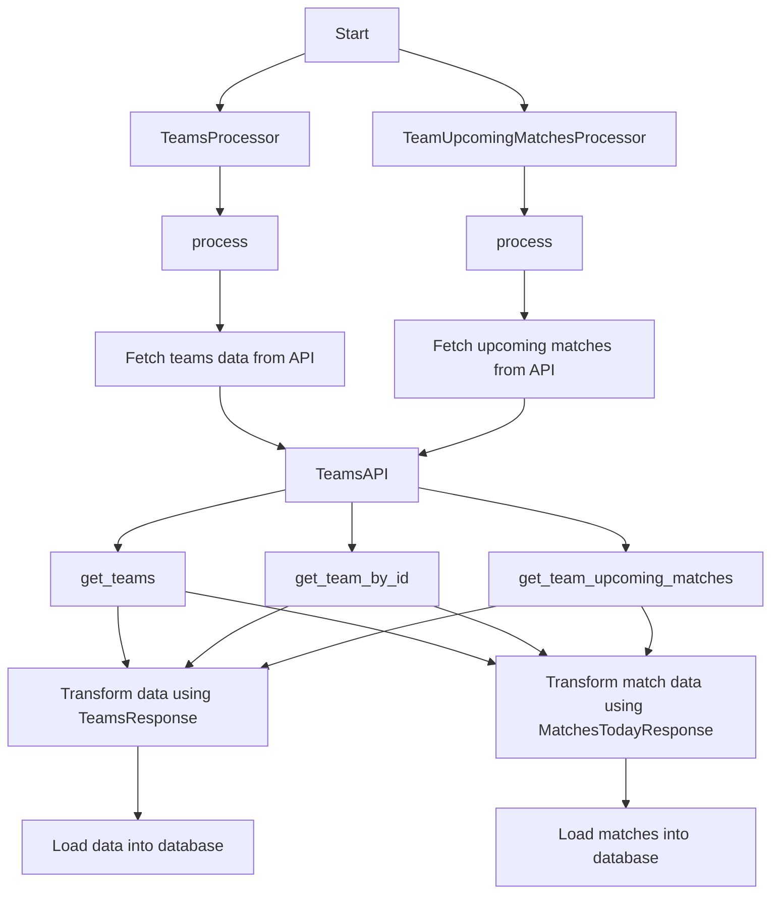

# Teams

## Workflow (Processor + API)


??? info "TeamsAPI Class"
    ::: src.utils.teams_api.TeamsAPI
        options:
            filters: []
            group_by_category: true
            members_order: source

??? info "TeamsProcessor Class"
    ::: src.utils.teams_api.TeamsProcessor
        options:
            filters: []
            group_by_category: true
            members_order: source

??? info "TeamsUpcomingMatchesProcessor Class"
    ::: src.utils.teams_api.TeamUpcomingMatchesProcessor
        options:
            filters: []
            group_by_category: true
            members_order: source

## Queries
??? info "Create Queries - Schema"
    ```sql
    --8<-- "src/utils/queries/create_queries.py"
    ```