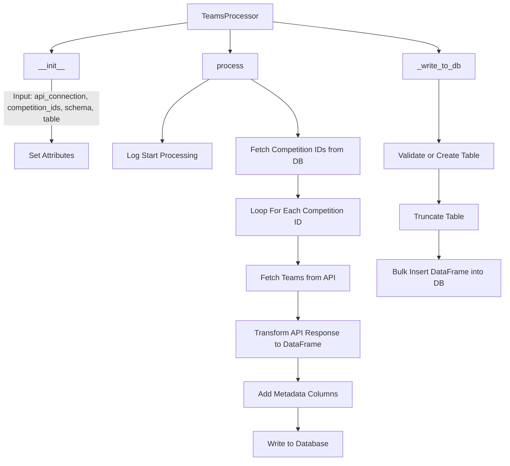

# Teams

## API


??? info "TeamsAPI Class"
    ::: src.utils.teams_api.TeamsAPI
        options:
            filters: []
            group_by_category: true
            members_order: source

## Processor

??? info "TeamsProcessor Class"
    ::: src.utils.teams_api.TeamsProcessor
        options:
            filters: []
            group_by_category: true
            members_order: source

<!-- ## Queries
??? info "Create Queries"
    ```sql
    --8<-- "src/data_sources/vendors/hgi/queries/hgi_create_queries.py"
    ``` -->